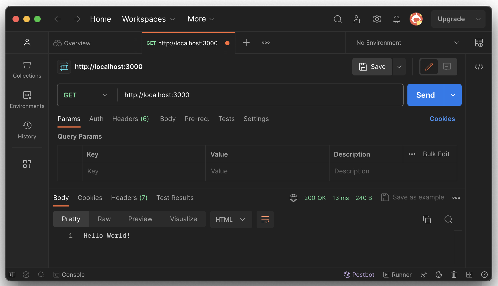

# Отправка HTTP-запросов

## Используем Telnet

```sh
% telnet localhost 3000
Trying ::1...
Connected to localhost.
Escape character is '^]'.
GET / HTTP/1.0

HTTP/1.1 200 OK
X-Powered-By: Express
Content-Type: text/html; charset=utf-8
Content-Length: 13
ETag: W/"d-oLZZOWcLwsAQ9NXWoLPk5FkPuSs"
Date: Thu, 16 Nov 2023 08:36:35 GMT
Connection: close

Hello World!
Connection closed by foreign host.
```

## Используем Postman

