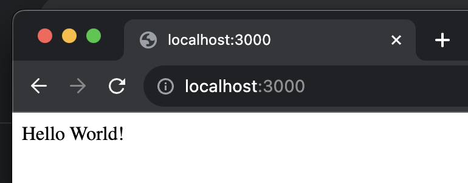

# Создаем простейший Web-server на Express.js

## Ознакомительная часть

- Создадим новый каталог:
```sh
mkdir simple-express-web-server
cd simple-express-web-server
```
- Подключим npm: `npm init`,
- На все вопросы выберем вариант по умолчанию, нажав Enter, на последний - ответим `yes`, например:
```sh
% npm init
This utility will walk you through creating a package.json file.
It only covers the most common items, and tries to guess sensible defaults.

See `npm help init` for definitive documentation on these fields
and exactly what they do.

Use `npm install <pkg>` afterwards to install a package and
save it as a dependency in the package.json file.

Press ^C at any time to quit.
package name: (simple-express-web-server) 
version: (1.0.0) 
description: 
entry point: (index.js) 
test command: [
git repository: 
keywords: 
author: 
license: (ISC) 
About to write to /Users/timurgogolev/sources/Experiments/simple-express-web-server/package.json:

{
  "name": "simple-express-web-server",
  "version": "1.0.0",
  "description": "",
  "main": "index.js",
  "scripts": {
    "test": "["
  },
  "author": "",
  "license": "ISC"
}


Is this OK? (yes) yes
```

- Подключим Express к нашему проекту:
```sh
npm i express
```

- Создадим файл index.js
- Добавим в него код простейшего сервера ([источник](https://expressjs.com/en/starter/hello-world.html), наш пример немного доработан добавлением символом перехода на следующую строку (`\n`)):
```js
const express = require('express');
const app = express();
const port = 3000;

app.get('/', (req, res) => {
  res.send("Hello World!\n");
});

app.listen(port, () => {
  console.log(`Example app listening on port ${port}`);
});
```

- Запустим проект:
```sh
node index.js
```

- В случае успешного запуска должна появиться надпись:
```sh
Example app listening on port 3000
```

- Выполним GET-запрос из браузера, перейдя по ссылке: http://localhost:3000/

- Должно получиться примерно как на картинке ниже:
