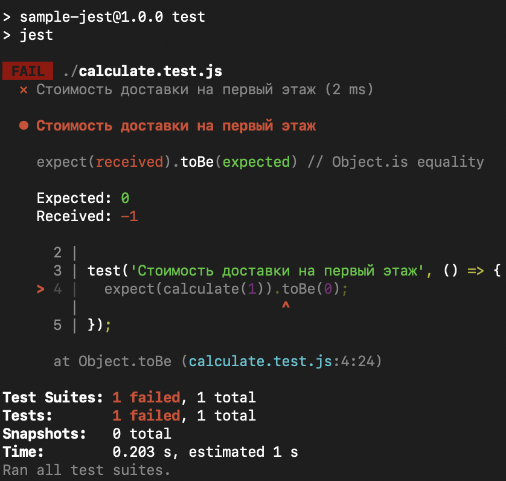
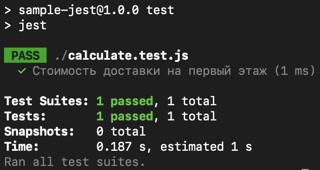

# Использование Jest для тестирования

[Документация](https://jestjs.io/ru/)

## Практика

Разберем пример использования тестов на Jest на примере задачи про [Расчет стоимости доставки](../exercises/easy/furniture-delivery-cost.md).

Создадим новый каталог для проекта
```sh
mkdir jest-sample
cd jest-sample
```

Инициализируем npm
```sh
npm init
npm install --save-dev jest
```

Создадим файл с функцией, которая решает задачу
```sh
touch calculate.js
```

Если функция еще не написана, запишем в `calculate.js` следующий код:
```js
// Функция для вычисления стоимости доставки по номеру этажа
function calculate(floor) {
    return -1; // TODO: Реализовать вычисление стоимости доставки
}

// Экспорт функции
module.exports = calculate;
```

Cоздадим файл для теста
```sh
touch calculate.test.js
```

Запишем в файл следующий код:
```js
const calculate = require('./calculate');

test('Стоимость доставки на первый этаж', () => {
  expect(calculate(1)).toBe(0);
});
```

Поменяем в `package.json` узел `"scripts"` на следующий:
```json
"scripts": {
    "test": "jest"
},
```

Запустим тесты:
```sh
npm run test
```

В моем случае тест завершается ошибкой, потому что в"место `0` отдает `-1`:


Исправим функцию `calculate` чтобы для первого этажа возвращался `0`.

Запустим тест еще раз, сейчас он должен пройти:


## Домашнее задание

Реализовать функцию `calculate(floor)` если это не было сделано ранее.
Дописать тест, чтобы он проверял значения для этажей с 1 по 10.

## ⭐️ Дополнительные баллы ⭐️

Написать тот же тест, используя `test.each` (см. [документацию](https://jestjs.io/ru/docs/api#testeachtablename-fn-timeout)) чтобы не писать `expect` каждый раз.